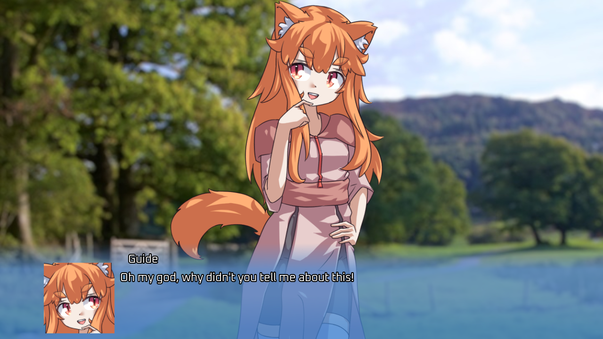

# Mini Mirage

Mini Mirage is a lightweight VN-style cutscene engine (not meant for actual VNs) for Godot 3.

Don't try to use this for actual VNs. It's missing a large number of essential VN features, like transition masks, saving mid-cutscene, a backlog, etc.

## Docs

Custom input actions you can add: 

`cutscene_advance` - to advance text. pressing down on this also causes currently-running animations to be skipped. 

(common example: m1, down arrow) 

`cutscene_instant_text` - to make text instantly appear, but not advance. also doesn't skip animations. 

(common example: on controllers, the "cancel" button. not needed if that button is bound to "ui_cancel".) 

`cutscene_skip` - hold to skip animations, including the text type-in effect. 

(common example: ctrl. please do not put this on alt.)

### Methods List

- `TextureRect add_background(texture: Texture)`
- `TextureRect add_tachie(texture: Texture)`
- `void adv_set_face(face: Texture, flipped: bool)`
- `void chat_set_face(face: Texture, flipped: bool)`
- `void clear_text()`
- `bool cutscene_is_running()`
- `void finish()`
- `void fix_chatbox_size(size: Vector2)`
- `void image_destroy(tr: TextureRect)`
- `void image_hide(tr: TextureRect, speed: float)`
- `void image_set_position(tr: TextureRect, pos: Vector2)`
- `void image_set_scale(tr: TextureRect, scale: Vector2)`
- `void image_set_texture(tr: TextureRect, tex: Texture)`
- `void image_show(tr: TextureRect, speed: float)`
- `void image_smooth_position(tr: TextureRect, pos: Vector2, speed: float)`
- `void image_smooth_scale(tr: TextureRect, scale: Vector2, speed: float)`
- `void set_nametag(tag: String)`
- `void set_text(text: String)`
- `bool should_advance_input()`
- `bool should_skip_anims()`
- `bool should_use_instant_text()`
- `void textbox_hide()`
- `void textbox_set_adv()`
- `void textbox_set_chat(pos: Vector2, orientation: String)`
- `void textbox_show()`

### Signals

- `cutscene_continue()`

Emitted when the user signals intent to continue the cutscene, e.g. by pressing confirm when the textbox has finished being typed in.

- `cutscene_finished()`

Emitted when the cutscene is finished.

- `textbox_transition_finished()`

Emitted when the textbox has finished being shown or hidden.

### Constants (that you can change)

- `typein_speed = 90`

Rate at which new characters are added to the textbox per second.

- ` skip_rate = 20`

Number of textboxes to skip per second when skipping.

Note: skipping is slowed down by one frame per other animation (tachie/background transitions etc).

- `tachie_fade_speed = 3`

Speed at which tachie (standing sprites) fade in. Higher values make them take less time. Reciprocal of seconds.

- `bg_fade_speed = 1.5`

Speed at which backgrounds fade in.

- `textbox_fade_speed = 4`

Speed at which the textbox fades in.

- `tachie_move_speed = 4`

Speed at which images move when smoothly moved. Reciprocal of seconds.

- `bg_move_speed = 0.5`

Speed at which images move when smoothly moved. Reciprocal of seconds.

### Method Descriptions

- `TextureRect add_background(texture: Texture)`

Adds a background to the scene, returning an image. 

Disclaimer: images are just TextureRects with special materials and signals attached.

- `TextureRect add_tachie(texture: Texture)`

Adds a tachie (standing sprite) to the scene, returning an image. 

Disclaimer: images are just TextureRects with special materials and signals attached.

- `void adv_set_face(face: Texture, flipped: bool)`

If in ADV mode, set the face of the next textboxes. Pass null to clear it. 

Applies instantly.

- `void chat_set_face(face: Texture, flipped: bool)`

If in chat-bubble mode, set the face of the next textboxes. Pass null to clear it. 

Applies instantly.

- `void clear_text()`

Clears the textbox.

- `void cutscene_is_running()`

Call to check whether any cutscenes are currently running. 

For example, you can use this function to ignore input or pause the game when cutscenes are running.

- `void finish()`

Call at the end of the cutscene to ensure proper cleanup.

- `void fix_chatbox_size(size: Vector2)`

Used internally. However, if the chatbox size for a given message is too small, you can use this function to override it.

- `void image_destroy(tr: TextureRect)`

Destroy an image, removing it from the scene and freeing its memory. 

The underlying texture will continue to exist until you stop using it (write null to whatever variable contains it). If you don't have the texture in a variable anywhere, then it will be freed immediately.

- `void image_hide(tr: TextureRect, speed: float)`

Hide the given image, playing a fade-out animation. 

Wait instruction: 

`yield(image, "transition_finished")`

- `void image_set_position(tr: TextureRect, pos: Vector2)`

Set the position for the given image. 

Positions are based on the height of the cutscene screen, with 1.0 representing the distance from the center of the screen to the top or bottom. 

So, a position of Vector2(1.0, 0.0) is only about half way towards the right side of a 16:9 screen. 

Applies instantly.

- `void image_set_scale(tr: TextureRect, scale: Vector2)`

Set the scale for the given image. 

Applies instantly.

- `void image_set_texture(tr: TextureRect, tex: Texture)`

Set the texture for the given image. 

Applies instantly.

- `void image_show(tr: TextureRect, speed: float)`

Show the given image, playing a fade-in animation. 

Wait instruction: 

`yield(image, "transition_finished")`

- `void image_smooth_position(tr: TextureRect, pos: Vector2, speed: float)`

Set the position for the given image smoothly. See image_set_position() for more information. 

Wait instruction: 

`yield(image, "transition_finished")`

- `void image_smooth_scale(tr: TextureRect, scale: Vector2, speed: float)`

Set the scale for the given image smoothly. 

Wait instruction: 

`yield(image, "transition_finished")`

- `void set_nametag(tag: String)`

Sets the speaker name. To empty, set to an empty string: "" 

Applies instantly. However, the nametag is only visible when text is drawn.

- `void set_text(text: String)`

Sets the textbox and makes the cutscene instance start to type in the new text and wait for input. 

To wait for the cutscene instance to get input from the user, use the following wait command: 

`yield(instance, "cutscene_continue")`

- `void should_advance_input()`

Returns whether the CutsceneInstance intends to advance the cutscene, based on user input.

- `void should_skip_anims()`

Returns whether the CutsceneInstance intends to skip animations, based on user input.

- `void should_use_instant_text()`

Returns whether the CutsceneInstance intends to make text come in instantly, based on user input.

- `void textbox_hide()`

Hide the current text box, playing a fade-out animation. 

Wait instruction: 

`yield(CutsceneInstance, "textbox_transition_finished")`

- `void textbox_set_adv()`

Switches to the ADV-style textbox. 

Applies instantly.

- `void textbox_set_chat(pos: Vector2, orientation: String)`

Switches to the chat-bubble-style textbox. 

Applies instantly.

- `void textbox_show()`

Show the current text box, playing a fade-in animation. 

Wait instruction: 

`yield(CutsceneInstance, "textbox_transition_finished")`

## Credits / License

Aside from the background image, which was made available by its creator under the Creative Commons Zero license on Flickr (at time of obtainment), and the font (Oxanium, licensed under the OFL, the standard open-source font license), everything in this project was made by me.

Everything made by me in this project, and everything that I obtained under the Creative Commons Zero license, is hereby released under the Creative Commons Zero license. You can use it all for any purpose without crediting me or doing anything special whatsoever. LICENSE.txt, a copy of the Creative Commons Zero 1.0 legal code, hereby applies to all relevant files.

In short: you can use this project however you want and do whatever you want with it (except for keeping other people from using it), almost as if you'd made it yourself.

However, keep in mind that Godot itself is licensed under the MIT license, so when you release a game/VN based on this project, you need to include its license texts alongside your game/VN in some form. The MIT license is permissive and not 'viral'; it does not restrict what you're allowed to do with your own code, or with this project's code. All you need to do is include the license text. For full instructions on complying with the licenses of Godot and its dependencies, see [this page](https://docs.godotengine.org/en/stable/about/complying_with_licenses.html) and [this page](https://godotengine.org/license).
